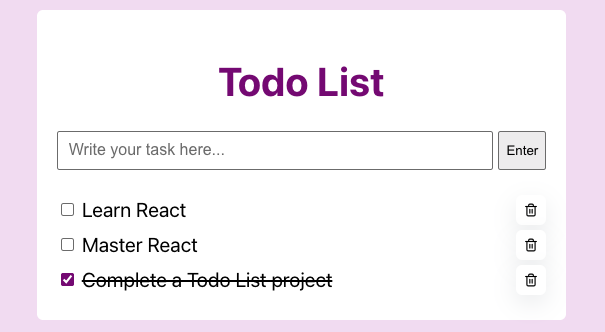

# Todo List App

---

This project is a simple website application where you can save your daily tasks.

## How to install the app

Firstly, install the project dependencies:

**`npm install`**

This command installs all the required packages listed in `package.json`.

## How to run the app

In the project directory, you can run:

**`npm start`**

Runs the app in the development mode.\
Open [http://localhost:3000](http://localhost:3000) to view it in the browser.

## Features

#### `Add New Task ✏️`

- Add new tasks using an input field.

#### `Delete Task 🗑️`

- Each task includes a delete button that allows users to remove it.

#### `Toggle Completed Status`

- Mark tasks as completed or uncompleted.

#### `Persistent Storage 💾`

- Tasks are saved in the browser’s localStorage, so they remain available after refreshing the page.

#### `Empty State Message ✉️`

- User sees an empty state when there are no tasks in the list.

#### `Input Validation ✔️`

- User sees an error message when trying to submit an empty task.

## What I have learned?

- Basic React Structure.
- Basic use of TypeScript.
- How to create a React component.
- How to add Prettier to a React project.
- Design Patterns such as `{myVar && <MyComponent>}`.
- What are hooks, and how to use them. Ex: `useState` and `useEffect`.
- Spread Operator (`...`).
- Destructuring Objects.

## Challenges and Solutions

#### `Data Persistence with localStorage 💾`

**Problem**
When refreshing the website, all tasks disappeared because React state resets on every render.

**Solution**
Used `useEffect` to store tasks in `localStorage`.

#### `Preventing Empty Task Submission ❌`

**Problem**
Users were able to submit empty tasks, or tasks with spaces in the beginning or ending.

**Solution**
Implemented a input validation before updating the tasks.

#### `Repeated Task ID 🆔`

**Problem**
When completed one task and added one new, both have the same ID.

**Solution**
Used `Date.now()` for unique IDs, this is only a good solution for a small scale project.

## Preview

